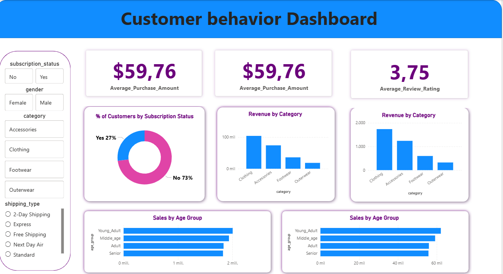

# Customer Shopping Behavior Analysis

End-to-end analytics project: cleaning and analyzing 3,900 customer records to uncover spending patterns, customer segments, and product preferences — translating findings into business recommendations for Marketing and Commercial teams.

**Stack:** Python (Pandas) → PostgreSQL (SQL) → Power BI → Executive deck (Gamma)

---

## Overview

This project analyzes customer-level shopping data to answer the kind of questions a Marketing or Product team actually asks:

- **Who** are our highest-revenue customers, and **why** are they highest-revenue?
- Are **subscribers** behaving differently from non-subscribers?
- Which **products** drive the best ratings and which depend most on discounts?
- How do we **segment** customers to design targeted campaigns?

The output is a Power BI dashboard, a written report, and an executive presentation with recommendations.

---

## Dataset

- **Source:** Public Kaggle dataset (*Customer Shopping Trends*) — synthetic data at customer level.
- **Size:** 3,900 rows × 18 columns
- **Granularity:** One row = one customer (current transaction + historical `Previous Purchases` count).
- **Missing values:** 37 (Review Rating only) — imputed by category median.

| Column                 | Type        | Description                                          |
| ---------------------- | ----------- | ---------------------------------------------------- |
| Customer ID            | int         | Unique customer identifier                           |
| Age                    | int         | 18 – 70                                              |
| Gender                 | categorical | Male / Female                                        |
| Item Purchased         | categorical | Specific product                                     |
| Category               | categorical | Clothing / Footwear / Accessories / Outerwear        |
| Purchase Amount (USD)  | int         | Current transaction value                            |
| Location               | categorical | US state (50 unique)                                 |
| Size, Color, Season    | categorical | Product attributes                                   |
| Review Rating          | float       | 1 – 5                                                |
| Subscription Status    | bool        | Yes / No                                             |
| Shipping Type          | categorical | Standard, Express, etc.                              |
| Discount Applied       | bool        | Yes / No                                             |
| Promo Code Used        | bool        | Yes / No (redundant with Discount Applied — dropped) |
| Previous Purchases     | int         | Historical purchase count                            |
| Payment Method         | categorical | Card, Cash, Venmo, etc.                              |
| Frequency of Purchases | categorical | Weekly, Fortnightly, Monthly, …                      |

---

## Tools & Tech Stack

| Stage                                   | Tool                                            |
| --------------------------------------- | ----------------------------------------------- |
| Data cleaning, EDA, feature engineering | **Python** (Pandas, NumPy, Matplotlib, Seaborn) |
| Storage and querying                    | **PostgreSQL** (SQLAlchemy + psycopg2)          |
| Dashboarding                            | **Power BI**                                    |
| Executive reporting                     | **Gamma** (slide deck)                          |
| Versioning                              | **Git / GitHub**                                |

---

## Project Workflow

**1. Data loading & exploration (Python)** — Loaded the CSV with Pandas, profiled types and distributions, and identified the 37 missing values in `Review Rating`.

**2. Cleaning & feature engineering**

- Renamed columns to `snake_case` for SQL compatibility.
- Imputed missing `review_rating` using the median per `category`.
- Dropped `promo_code_used` (fully redundant with `discount_applied`).
- Engineered:
  - `age_group` — bucketed into Young Adult / Adult / Middle-aged / Senior.
  - `customer_segment` — Loyal / Returning / New based on `previous_purchases` thresholds.

**3. SQL analysis (PostgreSQL)** — Loaded the cleaned DataFrame into PostgreSQL and ran queries for revenue breakdowns, segmentation, discount dependency, and subscriber comparisons. Queries available in `/sql`.

**4. Dashboarding (Power BI)** — Built an interactive dashboard with filters for Subscription, Gender, Category, and Shipping Type — revenue, sales volume, and key KPIs by category and age group.

**5. Reporting** — Findings consolidated into an executive deck (Gamma) and a written report.

---

## Dashboard



Interactive Power BI dashboard with:

- **KPIs:** 3.9K customers · $59.76 avg purchase · 3.75 avg rating
- **Filters:** Subscription status, Gender, Category, Shipping Type
- **Views:** Revenue by category, age group, and customer segment

📁 File: `dashboard/customer_shopping_analysis.pbix`
🖼️ Screenshot: `dashboard/screenshot.png`

---

## Key Findings

**Gender drives volume, not spend per customer.** Male customers generated 2.1× the total revenue of female customers ($157,890 vs $75,191), but this is driven by **volume, not by individual spending**: male customers make up 68% of the base (2,652 of 3,900), while average purchase amount per customer is nearly identical across genders.

**The subscription value proposition isn't differentiating spend.** Only 27% of customers are subscribed, and their average spend (~$59.50) is virtually identical to non-subscribers. The opportunity is less about pushing conversion and more about redesigning what subscribers actually get for subscribing.

**Loyalty is concentrated.** Customer segmentation by `previous_purchases`: **Loyal (3,116)**, **Returning (701)**, **New (83)**. The loyal segment dominates the base — protecting it should outweigh aggressive acquisition spend.

**Discount dependency is concentrated in five products.** The most-discounted items (Hat, Sneakers, Coat, Sweater, Pants) carry the highest discount rates — worth reviewing for margin protection.

**Highest-rated products skew toward accessories and footwear.** Top 5 by average rating: Gloves (3.86), Sandals (3.84), Boots (3.82), Hat (3.80), Skirt (3.78).

**Express shipping is a candidate upsell.** Express shippers spend slightly more on average ($60.48 vs $58.46) — small but worth A/B testing as an upsell prompt.

**Revenue is age-balanced.** Revenue is roughly even across age groups ($55K–$62K each); average customer age is 44 (range 18–70).

---

## Business Recommendations

1. **Redesign the subscription value proposition** — current data shows it does not lift spend.
2. **Build a loyalty program** anchored on the Loyal segment (3,116 customers), the company's core revenue base.
3. **Review the discount policy** on Hat, Sneakers, Coat, Sweater, and Pants — these carry the highest discount rates and warrant margin analysis.
4. **Test Express shipping promotion** as a low-risk upsell, given the small but consistent spend uplift.

---

## Repository Structure

```
customer_shopping_analysis/
├── README.md
├── requirements.txt
├── .gitignore
├── data/
│   └── customer_shopping_behavior.csv
├── notebooks/
│   └── 01.baseline_eda.ipynb
├── sql/
│   └── 01.analysis_queries.sql
├── dashboard/
│   ├── customer_shopping_analysis.pbix
│   └── screenshot.png
└── report/
    └── Customer-Shopping-Behavior-Analysis.pdf
```

---

## How to Run

**Requirements**

- Python 3.10+
- PostgreSQL 14+ (or compatible: MySQL / SQL Server with minor query adjustments)
- Power BI Desktop (for the `.pbix` file)

**Setup**

```bash
# 1. Clone and enter the repo
git clone https://github.com/FerminMargallo/customer_shopping_analysis.git
cd customer_shopping_analysis

# 2. Install Python dependencies
pip install -r requirements.txt
```

**Run the analysis**

```bash
# 3. Open the notebook (EDA + cleaning)
jupyter notebook notebooks/01.baseline_eda.ipynb

# 4. Run the SQL queries
psql -d customer_shopping -f sql/01.analysis_queries.sql
```

**View the dashboard** — open `dashboard/customer_shopping_analysis.pbix` in Power BI Desktop.

---

## Author

**Fermín Margallo** — Data Analyst
[GitHub](https://github.com/FerminMargallo) · [Email](mailto:fmargalloremon@gmail.com)
